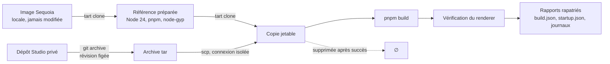

<div align="center">


# AI Desktop Studio — Action Fine-tuning

**Compagnon de préparation, d’essai et d’évaluation d’un assistant local multilingue pour AI Desktop Studio.**

[](https://github.com/pasquelin/AI-Desktop-Studio-Action-Fine-tuning/actions/workflows/validate.yml)
[](.node-version)
[](package.json)
[](tsconfig.json)
[](biome.json)
[](package.json)
[](LICENSE)

**[English ↗](README.md)** · **[→ AI Desktop Studio](https://www.aidesktopstudio.com/)**

</div>

---

## Ce que fait ce dépôt

Il prépare le terrain d’un assistant local pour AI Desktop Studio : téléchargement explicite du modèle local, essais réels dans une VM jetable, preuves conservées — **sans entraînement exécuté à ce jour**.

- **Extraire** le catalogue des actions de Studio depuis une révision précise, dans un bac à sable isolé du reste de l’application.
- **Inventorier** les scénarios d’usage — 310 actions réparties en 26 familles, en 15 langues — et signaler leur dérive quand Studio évolue.
- **Construire** Studio dans une machine virtuelle macOS jetable et vérifier que son interface monte, sans toucher au poste de travail.
- **Rejouer** un parcours métier dans cette VM, guidé par un modèle Ollama local, et conserver étapes, captures et journaux.
- **Piloter** tout cela depuis une interface locale unique, sur `http://127.0.0.1:4328/`.

Ce qui n’existe pas encore : la capture de données approuvée, l’entraînement LoRA réellement lancé et la mesure du gain.

## État réel

Chaque ligne dit ce qui est **exécuté et vérifié**, pas ce qui est prévu.

| Capacité | État | Preuve |
| --- | --- | --- |
| Linter, typage, tests, hygiène Git | 258 tests, sans modèle | `npm run validate` |
| Export du catalogue d’actions | Fonctionne, avec contrôle de fraîcheur | [docs/export.md](docs/export.md) |
| Inventaire des scénarios | 5 165 cas et 63 parcours, sans exécution | [docs/scenarios/](docs/scenarios/README.md) |
| Préparation et build en VM jetable | Recette réelle, rejouée | [docs/vm-usage.md](docs/vm-usage.md) |
| Chargement de l’interface Studio | Vérifié par son renderer, dans la VM | `startup.json` du rapport |
| Interface locale | Cinq vues : entraînement, QA, scénarios, rapports, compteurs | [docs/admin-ui.md](docs/admin-ui.md) |
| Parcours P003 de bout en bout | **Réussi, 13 étapes sur 13**, avec Qwen 3.8 local | `rapports/debug/77644922-…/` et ses 17 captures |
| Parcours projet, scène, cube | Réussi, 9 étapes | Onglet « Rapports » de l’interface |
| Campagnes Debug / QA guidées | Livrées : sélection du modèle, file, arrêt maîtrisé | [docs/qa-training-status.md](docs/qa-training-status.md) |
| Lancement LoRA | Raccordé à l’interface, **jamais exécuté pour de vrai** | [docs/qa-training-status.md](docs/qa-training-status.md) |
| Corpus approuvé, mesure du gain | **Non implémentés** | [docs/roadmap.md](docs/roadmap.md) |

> [!IMPORTANT]
> La QA actuelle est **guidée par les étapes** : le modèle reçoit l’opération et ses valeurs de référence, sa proposition est contrôlée, puis les assertions vérifient Studio. Cela teste la conformité des propositions et le comportement de Studio — **pas** la planification autonome d’un parcours depuis une demande libre.

> [!NOTE]
> La CI passe sur Linux et macOS. **Le job Windows échoue** sur une comparaison de chemins dans `src/catalogue/load-snapshot.ts` (noms courts 8.3 contre noms longs). Le badge ci-dessus reflète cet état réel plutôt que de le masquer.

## Démarrage

Prérequis : Git, Node **24.8 ou supérieur dans la branche 24**, pnpm **12.3.4** (npm **11** reste utilisable pour lancer les scripts). Aucun Python, GPU ou compte cloud nécessaire ici.

```sh
pnpm install --frozen-lockfile --ignore-scripts
pnpm run validate
```

L’installation initiale nécessite Internet ; la validation utilise ensuite les fichiers locaux. Aucun poids à installer pour les tests.

Si le lanceur pnpm local est indisponible :

```sh
npx --yes pnpm@12.3.4 install --frozen-lockfile --ignore-scripts
```

## Lancer l’application

```sh
pnpm start
```

Une seule commande : elle ouvre le serveur local sur **`http://127.0.0.1:4328/`** et prépare une copie VM persistante. Le terminal affiche l’adresse ; il n’y a ni clé à saisir, ni deuxième commande.

Aucun scénario, modèle ou entraînement ne démarre automatiquement. Un observateur déjà actif est réutilisé ; il reste disponible après un essai pour consulter les résultats, et fermer l’onglet ne stoppe rien. L’adresse ne change jamais, même après redémarrage — le port fixe n’accepte qu’un seul observateur, et le lancement échoue clairement s’il est occupé par autre chose. Elle est aussi écrite dans `artifacts/vm/observer.json`.

> [!TIP]
> Après une mise à jour du dépôt, arrêter l’observateur en cours avant de relancer : un process démarré avant vos derniers commits sert l’ancien code et ses anciennes routes.

`npm run vm:observe` consulte les rapports sans lancer de nouvel essai.

## L’interface

Cinq vues, servies par le même observateur local. Elles lisent les fichiers du dépôt et les rapports déjà écrits ; elles n’exécutent rien d’elles-mêmes et ne déduisent aucune réussite. La racine `/` est l’accueil ; les autres vues sont des fragments (`/#qa`, `/#scenarios`, `/#reports`, `/#overview`).

### Entraînement — l’accueil


Les trois chemins locaux exigés — exemples approuvés, manifeste, poids du modèle cible — puis le suivi partagé : le bureau de la VM à gauche, les étapes, journaux et captures à droite. Rien ne se lance implicitement, et le bandeau rappelle la règle : seuls les exemples approuvés avec preuves QA à jour sont admissibles, un jeu de test séparé reste obligatoire.

Aucun clic ni touche n’est envoyé à la VM depuis cette page.

### Debug / QA — les campagnes guidées


Choisir un modèle **installé** dans Ollama local, puis la portée : tous les scénarios, les parcours activés, une recette courte ou un parcours précis. Aucun modèle n’est codé en dur, aucun téléchargement n’est déclenché. L’absence de fournisseur ou de modèle, et une VM non prête, bloquent le lancement.

« Arrêter après ce scénario » laisse finir le scénario courant avant de stopper la file ; « Arrêter au premier échec » interrompt la campagne. Le modèle choisi pour la QA ne touche jamais au modèle cible de l’entraînement.

### Scénarios — le catalogue et l’éditeur


Les 5 228 éléments — 5 165 fiches de conception et 63 parcours — filtrables par recherche, type, langue et état. L’éditeur ouvre un parcours étape par étape : action Studio, paramètres et vérifications attendues en JSON validé contre le schéma partagé, traductions, activation.

Le serveur valide actions, paramètres et références à l’enregistrement ; aucune exécution n’est déclenchée. Une fiche n’est pas un test exécuté — la vue le dit elle-même sous le compteur.

### Rapports — les preuves conservées


Trois rubriques : **Entraînement**, **Campagnes Debug / QA** et **Archives VM**. Chaque essai conserve ses étapes, ses captures, ses preuves et ses journaux. Une étape échouée montre l’erreur brute renvoyée par Studio, et les étapes suivantes sont marquées bloquées plutôt que rejouées.

L’état de la VM reste distinct du résultat métier : une VM nettoyée ne vaut pas un parcours réussi, et « aucun résultat métier » n’est ni une réussite ni un échec.

### Vue d’ensemble — l’état calculé


Les compteurs sont calculés depuis les fichiers actuels, pas depuis un historique. Ils disent ce qui est prêt à être tenté, pas ce qui est validé : « prêt à essayer » ne signifie pas validé dans Studio, « activé » ne signifie pas approuvé pour l’entraînement, et la présence d’un texte dans une langue ne valide pas sa traduction — la colonne « Vérification » affiche « qualité non certifiée » partout, et c’est exact.

Détail des vues et de leurs routes : [interface](docs/admin-ui.md) et [administration locale](docs/administration.md).

### Visuel et journaux dans la même fenêtre

Le bureau invité occupe le panneau gauche ; le panneau droit montre les étapes et les sorties de la dernière exécution. La page tient dans la hauteur disponible : le défilement reste dans le journal. Sur un écran étroit, les panneaux passent l’un au-dessus de l’autre.

Les journaux se chargent automatiquement, puis se mettent à jour toutes les deux secondes lorsque l’onglet est visible. Décocher **Suivre la fin** pour remonter dans l’historique sans être ramené en bas. Ils restent consultables après le nettoyage de la VM.

Le défilement manuel suspend le suivi de fin pendant trente secondes après le dernier mouvement, pour les étapes, les journaux et les captures. Un nouveau mouvement relance ce délai ; ensuite le suivi reprend automatiquement.

Les captures sont produites après les actions, avec leur résultat, indépendamment de l’ouverture de la page. Seule la dernière session est conservée dans `artifacts/vm/captures/`, dans l’ordre chronologique.

Pour les limites, le nettoyage et les rapports : [mode d’emploi VM](docs/vm-usage.md).

## Commandes

### Qualité

| Commande | Fonction |
| --- | --- |
| `npm run validate` | Toute la chaîne : linter, typage, tests, configuration, hygiène et fraîcheur |
| `npm run format` | Formatage et corrections sûres de Biome |
| `npm test` | Tests exécutés une fois |
| `npm run test:watch` | Tests pendant le développement |
| `npm run config:check` | Validation de la configuration |
| `npm run repo:check` | Noms, types et tailles des fichiers candidats Git |

### Catalogue et scénarios

| Commande | Fonction |
| --- | --- |
| `npm run catalogue:export -- --source CHEMIN` | Export complet depuis un checkout Studio |
| `npm run catalogue:check` | Contrôle de fraîcheur du catalogue configuré |
| `npm run freshness:check` | Écart entre scénarios, modèle et checkout Studio (avertissements) |
| `npm run scenarios:index` | Index de recherche des fiches |

### Machine virtuelle

| Commande | Fonction |
| --- | --- |
| `npm run vm:observe` | Affiche l’adresse de la page locale d’observation |
| `npm run vm:run` | Enchaîne préparation et build dans une VM jetable |
| `npm run vm -- check` | Version de Tart et VM locales |
| `npm run vm -- prepare --source IMAGE` | Prépare une référence depuis une image locale |
| `npm run vm -- build --base REFERENCE` | Construit Studio dans une copie jetable |
| `npm run vm -- cleanup --name VM` | Supprime une VM appartenant à ce dépôt |

Mac Apple Silicon et [Tart](https://tart.run) requis pour les commandes VM. Détail dans [le mode d’emploi](docs/vm-usage.md).

## Comment le banc VM fonctionne



Aucun partage de dossier, de presse-papiers ou de son. La copie de build est détruite au succès et conservée à l’échec, pour diagnostic. Les identifiants de l’hôte n’entrent jamais dans l’invité : seule une clé SSH dédiée au banc est générée, et seule sa partie publique est transférée.

## Organisation

| Dossier | Responsabilité |
| --- | --- |
| `src/config/` | Validation des configurations |
| `src/repository/` | Contrôles d’hygiène |
| `src/catalogue/` | Export du catalogue d’actions depuis Studio |
| `src/scenarios/` | Inventaire des scénarios et contrôle de fraîcheur |
| `src/studio/` | Lecture du checkout Studio configuré |
| `src/vm/` | Cycle de vie, propriété et transport des VM |
| `src/qa/` | Campagnes Debug / QA guidées et leur service local |
| `src/training/` | Préparation, lancement et rapports LoRA |
| `src/admin/` | Interface locale et lecture des scénarios et rapports |
| `tools/` | Commandes locales |
| `configs/` | Choix du pilote, sans chemins personnels |
| `schemas/` | Formats versionnés implémentés |
| `tests/` | Comportements et rejets |
| `docs/` | Décisions, étapes et cadrage initial contextualisé |

## Modèles candidats

Modèle principal candidat : **Qwen3.5-2B** ; comparaison : **Qwen3-1.7B**. La configuration ne télécharge rien. Le premier essai Ollama conserve le format et l’empreinte du modèle. Les quinze langues configurées sont couvertes par des brouillons relus par IA, pas par une validation mondiale démontrée.

## Premier essai du modèle local

Ollama doit être installé et démarré. `npm run model:pull` télécharge explicitement Qwen3.5-2B. `npm run model:check` vérifie sa présence et affiche son empreinte. `npm run model:eval` réalise 34 demandes synthétiques sur 15 langues, sans exécuter une action Studio. Les commandes fonctionnent aussi avec `pnpm`.

Les rapports sont dans `artifacts/model/baseline.md` et `baseline.json`, hors Git. Ce sont des propositions avant entraînement, pas des scénarios métier validés. [Protocole et limites](docs/model-usage.md).

## Scénarios, exemples et couverture

`npm run scenarios:prepare` prépare les 5 165 cas et 63 parcours depuis les documents sources. Le résultat est consultable dans `artifacts/scenarios/README.md`. Les sources versionnables vivent dans `datasets/scenarios/` : variantes de paramètres, instructions et demandes des parcours en quinze langues, et références aux fixtures et contrôles du banc Studio. La génération refuse les doublons, actions sans cas, traductions absentes et paramètres de traduction perdus.

**Ce sont des brouillons, pas des scénarios opérationnels ni des données approuvées pour l’entraînement.** Les traductions automatiques peuvent changer le sens malgré une structure valide. Il reste à relire chaque formulation, construire les dialogues des cas individuels, lier les ressources réelles, préciser les contrôles métier et vérifier l’exécution. Les verdicts de schéma concernent les paramètres internes des actions ; ils ne prouvent ni le contrat MCP ni le résultat métier.

- `npm run scenarios:examples` : variantes de requêtes et exemples précis, avec blocages explicites. Voir [les limites métier](docs/scenario-examples.md).
- `npm run scenarios:split` : plan de séparation par familles, sans approbation automatique.
- La [stratégie multilingue](docs/multilingual-strategy.md) fixe les quinze langues, la relecture, les variantes et la séparation entraînement/test. Le [registre de couverture](docs/multilingual-coverage.csv) rattache les cas aux 310 actions et réserve leurs quinze couvertures linguistiques ; les cellules `planned` signalent un travail restant.
- Recherche locale des scénarios : [index et petits fichiers canoniques](docs/scenarios/search.md).

## Banc de validation avant entraînement

`npm run bench:run` exécute un parcours dans la VM avec le moteur commun et ses preuves ; `npm run bench:run -- --journey P003` cible un parcours précis, VM et observateur démarrant ensemble. `npm run prepare:bench` prépare les fichiers et vérifie les 63 parcours déclaratifs : le rapport `artifacts/bench/preparation.json` distingue ceux qui peuvent être tentés de ceux qui attendent des fixtures ou des vérifications complémentaires. **Ce nombre ne représente pas des tests réussis.**

Les exemples restent exclus de LoRA tant que la preuve réelle et la relecture sémantique ne sont pas acceptées. [Fonctionnement et couverture réellement exécutable](docs/test-bench.md).

## Entraînement LoRA : raccordé, pas exécuté

MLX-LM et MLX sont installés, et la page Entraînement raccorde la chaîne : préparation des exemples admissibles, contrôle des trois chemins locaux, lancement explicite, rapports séparés dans `rapports/entrainement/`. Les poids restent dans `artifacts/training/`.

Le raccordement est testé avec des processus simulés. **Aucun entraînement réel n’a été lancé**, pour trois raisons constatées :

1. Aucun corpus approuvé `train.jsonl`, `valid.jsonl`, `test.jsonl` dans les dossiers vérifiés ; les manifestes indiquent zéro exemple approuvé.
2. Aucun chemin de poids MLX compatible configuré — un modèle Ollama ne remplace pas ces fichiers.
3. Le calcul de comparaison avant/après et la promotion d’un adaptateur restent à raccorder. Un calcul terminé n’est pas une amélioration démontrée.

[Installation et configuration LoRA](training/README.md) · [état détaillé](docs/qa-training-status.md).

## Où vont les fichiers

| Emplacement | Contenu |
| --- | --- |
| `rapports/debug/` | Tentatives Debug / QA, une par dossier, avec captures et journaux |
| `rapports/debug/campagnes/` | Synthèses JSON et Markdown des campagnes |
| `rapports/entrainement/` | Configurations et résultats LoRA |
| `artifacts/vm/` | Sessions VM, preuves des essais et dernière série de captures |
| `artifacts/training/` | Poids produits localement |

Ces dossiers restent hors Git.

## Documentation

| Document | Contenu |
| --- | --- |
| [Contribution](CONTRIBUTING.md) | Règles de travail sur ce dépôt |
| [Décisions](docs/decisions.md) | Choix arrêtés et leurs raisons |
| [Étapes](docs/roadmap.md) | Ce qui reste à faire, dans l’ordre |
| [État Debug / QA et entraînement](docs/qa-training-status.md) | Ce qui est livré, ce qui bloque |
| [Export](docs/export.md) | Contrat et résultats de l’export du catalogue |
| [Scénarios](docs/scenarios/README.md) | Actions MCP, demandes existantes et cas candidats |
| [Environnement VM](docs/vm-environment.md) | Cadrage et choix d’isolation |
| [Mode d’emploi VM](docs/vm-usage.md) | Commandes, limites et recette réelle |
| [Interface](docs/admin-ui.md) | Vues, routes et navigation de l’interface |
| [Administration locale](docs/administration.md) | Service local, scénarios et rapports |
| [Validation](docs/validation.md) | Ce qui est contrôlé, et ce qui ne l’est pas |

## Organisation Git

`develop` accueille le travail courant. `main` est réservée aux versions à déployer. Aucun worktree supplémentaire.

## Licence

**[PolyForm Noncommercial 1.0.0](LICENSE)** — la même licence qu’AI Desktop Studio, dont ce
dépôt fait partie. Tout usage non commercial est permis : étude, recherche, expérimentation,
projets personnels, enseignement et organismes à but non lucratif. L’usage commercial ne
l’est pas.

Cette licence couvre le code de ce dépôt. Elle ne couvre ni les dépendances tierces, ni les
modèles candidats qu’il nomme : Apache 2.0 sur un modèle ne s’étend pas à ce code.
