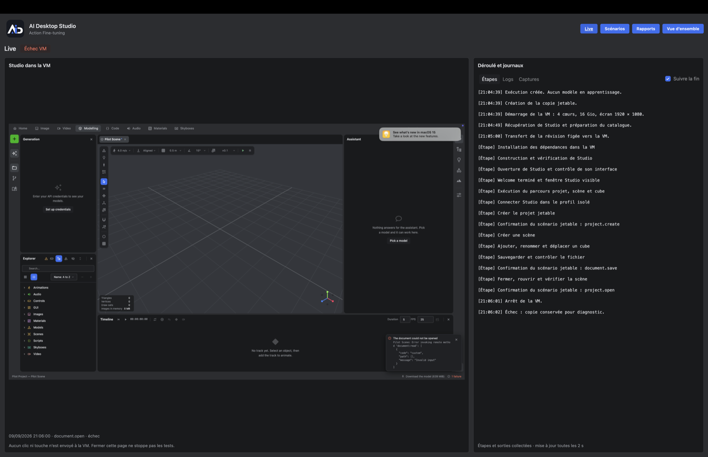
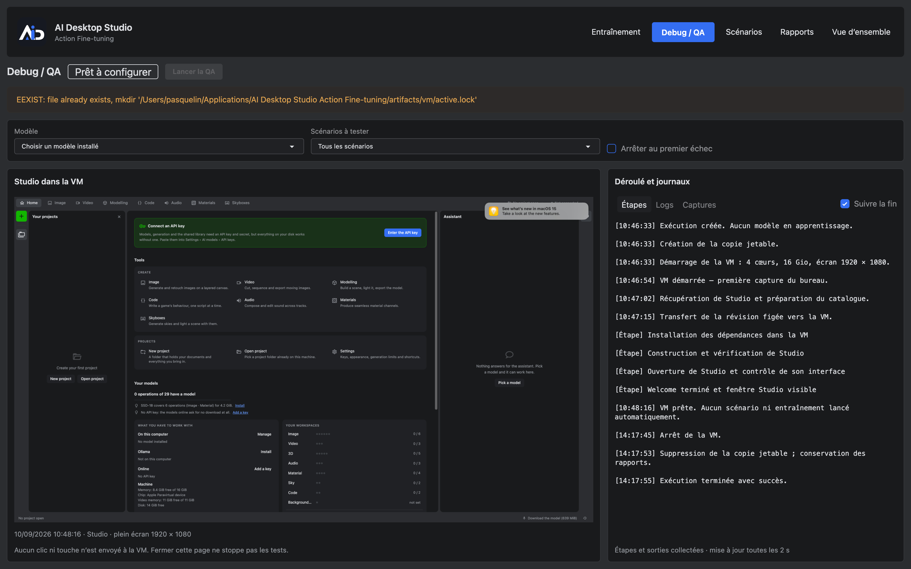
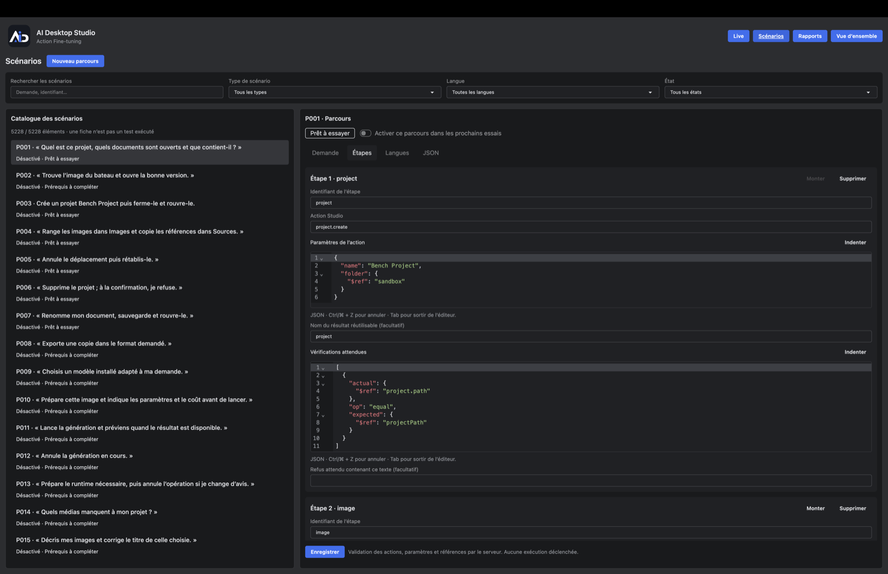
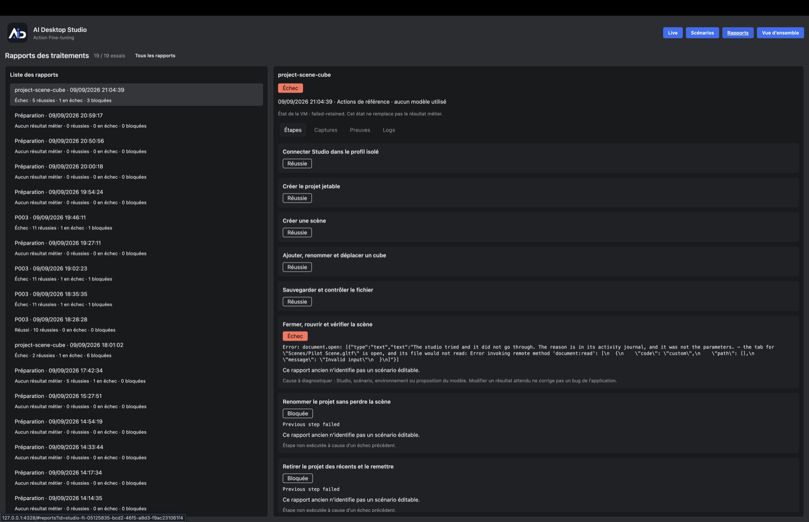
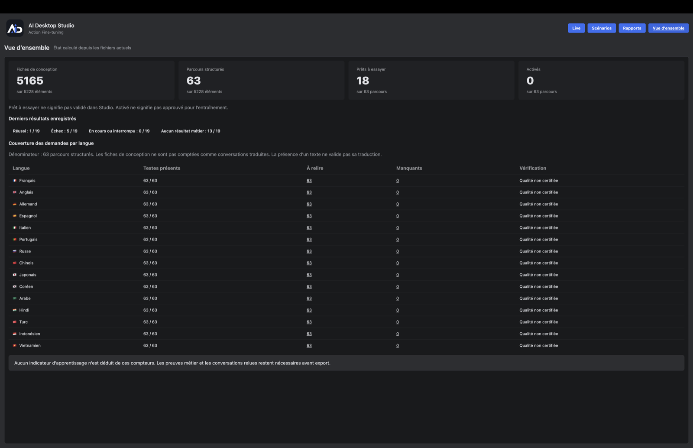
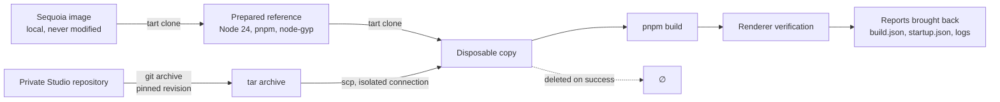

<div align="center">


# AI Desktop Studio — Action Fine-tuning

**Companion for preparing, trying out and evaluating a local multilingual assistant for AI Desktop Studio.**

[](https://github.com/pasquelin/ai-desktop-studio-finetuning/actions/workflows/validate.yml)
[](.node-version)
[](package.json)
[](tsconfig.json)
[](biome.json)
[](package.json)
[](LICENSE)

**[Documentation 🇫🇷](README.fr.md)** · **[→ AI Desktop Studio](https://www.aidesktopstudio.com/)**

</div>

---

## What this repository does

It lays the ground for a local assistant for AI Desktop Studio: explicit download of the local model, real trials in a disposable VM, evidence kept — **with no training run to date**.

- **Export** Studio's action catalogue from a precise revision, in a sandbox isolated from the rest of the application.
- **Inventory** the usage scenarios — 310 actions across 26 families, in 15 languages — and report their drift as Studio evolves.
- **Build** Studio inside a disposable macOS virtual machine and check that its interface comes up, without touching the workstation.
- **Replay** a real user journey in that VM, guided by a local Ollama model, keeping steps, screenshots and logs.
- **Drive** all of it from a single local interface, at `http://127.0.0.1:4328/`.

What does not exist yet: approved data capture, LoRA training actually launched, and measurement of the gain.

## Actual state

Every line states what is **executed and verified**, not what is planned.

| Capability | State | Evidence |
| --- | --- | --- |
| Linter, typing, tests, Git hygiene | 258 tests, no model | `npm run validate` |
| Action catalogue export | Works, with a freshness check | [docs/export.md](docs/export.md) |
| Scenario inventory | 5,165 cases and 63 journeys, not executed | [docs/scenarios/](docs/scenarios/README.md) |
| Preparation and build in a disposable VM | Real procedure, replayed | [docs/vm-usage.md](docs/vm-usage.md) |
| Studio interface loading | Verified through its renderer, inside the VM | the report's `startup.json` |
| Local interface | Five views: training, QA, scenarios, reports, counters | [docs/admin-ui.md](docs/admin-ui.md) |
| P003 journey end to end | **Passed, 13 steps out of 13**, with a local Qwen 3.8 | `rapports/debug/77644922-…/` and its 17 screenshots |
| Project, scene, cube journey | Passed, 9 steps | The interface's "Reports" tab |
| Guided Debug / QA campaigns | Delivered: model selection, queue, controlled stop | [docs/qa-training-status.md](docs/qa-training-status.md) |
| LoRA launch | Wired into the interface, **never actually run** | [docs/qa-training-status.md](docs/qa-training-status.md) |
| Approved corpus, measurement of the gain | **Not implemented** | [docs/roadmap.md](docs/roadmap.md) |

> [!IMPORTANT]
> The current QA is **step-guided**: the model receives the operation and its reference values, its proposal is checked, then assertions verify Studio. That tests how well proposals conform and how Studio behaves — **not** autonomous planning of a journey from a free-form request.

> [!NOTE]
> CI passes on Linux and macOS. **The Windows job fails** on a path comparison in `src/catalogue/load-snapshot.ts` (8.3 short names against long names). The badge above reflects that real state rather than hiding it.

## Getting started

Requirements: Git, Node **24.8 or above within the 24 branch**, pnpm **12.3.4** (npm **11** still works to run the scripts). No Python, GPU or cloud account needed here.

```sh
pnpm install --frozen-lockfile --ignore-scripts
pnpm run validate
```

The initial install needs the Internet; validation then uses local files only. No weights to install for the tests.

If the local pnpm launcher is unavailable:

```sh
npx --yes pnpm@12.3.4 install --frozen-lockfile --ignore-scripts
```

## Running the application

```sh
pnpm start
```

One command: it opens the local server on **`http://127.0.0.1:4328/`** and prepares a persistent VM copy. The terminal prints the address; there is no key to enter and no second command.

No scenario, model or training starts automatically. An observer already running is reused; it stays available after a trial so results can be inspected, and closing the tab stops nothing. The address never changes, even after a restart — the fixed port accepts a single observer, and startup fails clearly if something else holds it. It is also written to `artifacts/vm/observer.json`.

> [!TIP]
> After updating the repository, stop the running observer before relaunching: a process started before your latest commits serves the old code and its old routes.

`npm run vm:observe` inspects the reports without starting a new trial.

## The interface

Five views, served by the same local observer. They read the repository's files and the reports already written; they execute nothing themselves and infer no success. The root `/` is the home page; the other views are fragments (`/#qa`, `/#scenarios`, `/#reports`, `/#overview`).

### Training — the home page



The three required local paths — approved examples, manifest, target model weights — then the shared monitoring: the VM desktop on the left, the steps, logs and screenshots on the right. Nothing starts implicitly, and the banner restates the rule: only approved examples with up-to-date QA evidence are eligible, and a separate test set remains mandatory.

No click or keystroke is sent to the VM from this page.

### Debug / QA — the guided campaigns



Pick a model **installed** in the local Ollama, then the scope: all scenarios, the enabled journeys, a short run or one precise journey. No model is hard-coded and no download is triggered. A missing provider or model, or a VM that is not ready, blocks the launch.

"Stop after this scenario" lets the current scenario finish before stopping the queue; "Stop on first failure" interrupts the campaign. The model chosen for QA never touches the training target model.

### Scenarios — the catalogue and the editor



The 5,228 items — 5,165 design sheets and 63 journeys — filterable by search, type, language and state. The editor opens a journey step by step: Studio action, parameters and expected checks as JSON validated against the shared schema, translations, activation.

The server validates actions, parameters and references on save; no execution is triggered. A sheet is not an executed test — the view says so itself, under the counter.

### Reports — the evidence kept



Three sections: **Training**, **Debug / QA campaigns** and **VM archives**. Every trial keeps its steps, screenshots, evidence and logs. A failed step shows the raw error returned by Studio, and the following steps are marked blocked rather than replayed.

The VM's state stays distinct from the business result: a cleaned-up VM is not a successful journey, and "no business result" is neither a pass nor a failure.

### Overview — the computed state



The counters are computed from the current files, not from a history. They say what is ready to be attempted, not what is validated: "ready to try" does not mean validated in Studio, "enabled" does not mean approved for training, and the presence of a text in a language does not validate its translation — the "Verification" column reads "quality not certified" everywhere, and that is accurate.

Details of the views and their routes: [interface](docs/admin-ui.md) and [local administration](docs/administration.md).

### Visuals and logs in the same window

The guest desktop takes the left panel; the right panel shows the steps and outputs of the last run. The page fits the available height: scrolling stays inside the log. On a narrow screen, the panels stack.

Logs load automatically, then refresh every two seconds while the tab is visible. Untick **Follow the end** to scroll back through history without being pulled back down. They remain readable after the VM is cleaned up.

Manual scrolling suspends end-following for thirty seconds after the last movement, for steps, logs and screenshots alike. Another movement restarts that delay; following then resumes on its own.

Screenshots are produced after actions, with their result, whether or not the page is open. Only the last session is kept, in `artifacts/vm/captures/`, in chronological order.

For limits, cleanup and reports: [VM guide](docs/vm-usage.md).

## Commands

### Quality

| Command | Purpose |
| --- | --- |
| `npm run validate` | The whole chain: linter, typing, tests, configuration, hygiene and freshness |
| `npm run format` | Biome formatting and safe fixes |
| `npm test` | Tests, run once |
| `npm run test:watch` | Tests during development |
| `npm run config:check` | Configuration validation |
| `npm run repo:check` | Names, types and sizes of Git candidate files |

### Catalogue and scenarios

| Command | Purpose |
| --- | --- |
| `npm run catalogue:export -- --source PATH` | Full export from a Studio checkout |
| `npm run catalogue:check` | Freshness check of the configured catalogue |
| `npm run freshness:check` | Drift between scenarios, model and the Studio checkout (warnings) |
| `npm run scenarios:index` | Search index of the sheets |

### Virtual machine

| Command | Purpose |
| --- | --- |
| `npm run vm:observe` | Prints the address of the local observation page |
| `npm run vm:run` | Chains preparation and build in a disposable VM |
| `npm run vm -- check` | Tart version and local VMs |
| `npm run vm -- prepare --source IMAGE` | Prepares a reference from a local image |
| `npm run vm -- build --base REFERENCE` | Builds Studio in a disposable copy |
| `npm run vm -- cleanup --name VM` | Removes a VM owned by this repository |

An Apple Silicon Mac and [Tart](https://tart.run) are required for the VM commands. Details in [the guide](docs/vm-usage.md).

## How the VM bench works



No shared folder, clipboard or audio. The build copy is destroyed on success and kept on failure, for diagnosis. Host credentials never enter the guest: only an SSH key dedicated to the bench is generated, and only its public half is transferred.

## Layout

| Folder | Responsibility |
| --- | --- |
| `src/config/` | Configuration validation |
| `src/repository/` | Hygiene checks |
| `src/catalogue/` | Action catalogue export from Studio |
| `src/scenarios/` | Scenario inventory and freshness check |
| `src/studio/` | Reading the configured Studio checkout |
| `src/vm/` | VM lifecycle, ownership and transport |
| `src/qa/` | Guided Debug / QA campaigns and their local service |
| `src/training/` | LoRA preparation, launch and reports |
| `src/admin/` | Local interface, reading scenarios and reports |
| `tools/` | Local commands |
| `configs/` | Driver choice, with no personal paths |
| `schemas/` | Implemented versioned formats |
| `tests/` | Behaviours and rejections |
| `docs/` | Decisions, milestones and the initial framing in context |

## Candidate models

Main candidate model: **Qwen3.5-2B**; comparison: **Qwen3-1.7B**. The configuration downloads nothing. The first Ollama trial records the model's format and fingerprint. The fifteen configured languages are covered by AI-reviewed drafts, not by demonstrated worldwide validation.

## First trial of the local model

Ollama must be installed and running. `npm run model:pull` explicitly downloads Qwen3.5-2B. `npm run model:check` verifies its presence and prints its fingerprint. `npm run model:eval` runs 34 synthetic requests across 15 languages, without executing a single Studio action. The commands also work with `pnpm`.

Reports land in `artifacts/model/baseline.md` and `baseline.json`, outside Git. They are pre-training proposals, not validated business scenarios. [Protocol and limits](docs/model-usage.md).

## Scenarios, examples and coverage

`npm run scenarios:prepare` prepares the 5,165 cases and 63 journeys from the source documents. The result can be read in `artifacts/scenarios/README.md`. The versionable sources live in `datasets/scenarios/`: parameter variants, instructions and journey requests in fifteen languages, and references to the Studio bench's fixtures and checks. Generation refuses duplicates, actions without a case, missing translations and lost translation parameters.

**These are drafts, not operational scenarios, and not data approved for training.** Machine translations can change the meaning while keeping a valid structure. Each wording still has to be reviewed, the dialogues of individual cases built, real resources linked, business checks made precise and execution verified. Schema verdicts cover the actions' internal parameters; they prove neither the MCP contract nor the business result.

- `npm run scenarios:examples`: request variants and precise examples, with explicit blockers. See [the business limits](docs/scenario-examples.md).
- `npm run scenarios:split`: split plan by family, with no automatic approval.
- The [multilingual strategy](docs/multilingual-strategy.md) fixes the fifteen languages, the review, the variants and the train/test split. The [coverage registry](docs/multilingual-coverage.csv) ties the cases to the 310 actions and reserves their fifteen language coverages; `planned` cells flag work still to do.
- Local scenario search: [index and small canonical files](docs/scenarios/search.md).

## Validation bench before training

`npm run bench:run` runs a journey in the VM with the shared engine and its evidence; `npm run bench:run -- --journey P003` targets one precise journey, VM and observer starting together. `npm run prepare:bench` prepares the files and checks the 63 declarative journeys: the `artifacts/bench/preparation.json` report separates those that can be attempted from those waiting on fixtures or extra checks. **That number does not represent passing tests.**

Examples stay out of LoRA until real evidence and semantic review are accepted. [How it works, and what is genuinely executable](docs/test-bench.md).

## LoRA training: wired, not run

MLX-LM and MLX are installed, and the Training page wires the chain: preparation of eligible examples, checking of the three local paths, explicit launch, separate reports in `rapports/entrainement/`. The weights stay in `artifacts/training/`.

The wiring is tested with simulated processes. **No real training has been launched**, for three observed reasons:

1. No approved `train.jsonl`, `valid.jsonl`, `test.jsonl` corpus in the checked folders; the manifests report zero approved examples.
2. No compatible MLX weights path configured — an Ollama model does not replace those files.
3. The before/after comparison and the promotion of an adapter are still to be wired. A finished computation is not a demonstrated improvement.

[LoRA installation and configuration](training/README.md) · [detailed state](docs/qa-training-status.md).

## Where the files go

| Location | Content |
| --- | --- |
| `rapports/debug/` | Debug / QA attempts, one per folder, with screenshots and logs |
| `rapports/debug/campagnes/` | JSON and Markdown campaign summaries |
| `rapports/entrainement/` | LoRA configurations and results |
| `artifacts/vm/` | VM sessions, trial evidence and the latest set of screenshots |
| `artifacts/training/` | Locally produced weights |

Those folders stay outside Git.

## Documentation

The documents below are written in French.

| Document | Content |
| --- | --- |
| [Contributing](CONTRIBUTING.md) | Working rules for this repository |
| [Decisions](docs/decisions.md) | Settled choices and their reasons |
| [Milestones](docs/roadmap.md) | What is left to do, in order |
| [Debug / QA and training state](docs/qa-training-status.md) | What is delivered, what is blocking |
| [Export](docs/export.md) | Contract and results of the catalogue export |
| [Scenarios](docs/scenarios/README.md) | MCP actions, existing requests and candidate cases |
| [VM environment](docs/vm-environment.md) | Framing and isolation choices |
| [VM guide](docs/vm-usage.md) | Commands, limits and the real procedure |
| [Interface](docs/admin-ui.md) | Views, routes and navigation |
| [Local administration](docs/administration.md) | Local service, scenarios and reports |
| [Validation](docs/validation.md) | What is checked, and what is not |

## Git layout

`develop` carries current work. `main` is reserved for versions to deploy. No extra worktree.

## Licence

**[PolyForm Noncommercial 1.0.0](LICENSE)** — the same licence as AI Desktop Studio, of which this
repository is part. Any non-commercial use is permitted: study, research, experimentation,
personal projects, teaching and non-profit organisations. Commercial use is not.

This licence covers the code in this repository. It covers neither the third-party dependencies
nor the candidate models it names: Apache 2.0 on a model does not extend to this code.
