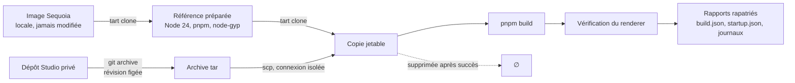

<div align="center">

# AI Desktop Studio — Action Fine-tuning

**Compagnon de préparation et d’évaluation d’un assistant local multilingue pour AI Desktop Studio.**

[](https://github.com/pasquelin/AI-Desktop-Studio-Action-Fine-tuning/actions/workflows/validate.yml)
[](.node-version)
[](package.json)
[](tsconfig.json)
[](biome.json)
[](package.json)
[](#licence)

</div>

---

## Ce que fait ce dépôt

Il prépare le terrain d’un assistant local pour AI Desktop Studio, **sans jamais télécharger ni entraîner de modèle**. Trois choses fonctionnent aujourd’hui :

- **Extraire** le catalogue des actions de Studio depuis une révision précise, dans un bac à sable isolé du reste de l’application.
- **Inventorier** les scénarios d’usage — 310 actions réparties en 26 familles — et signaler leur dérive quand Studio évolue.
- **Construire** Studio dans une machine virtuelle macOS jetable et vérifier que son interface monte, sans toucher au poste de travail.

Ce qui n’existe pas encore : les parcours exécutés dans l’application, la capture de données et l’entraînement.

## État réel

Chaque ligne dit ce qui est **exécuté et vérifié**, pas ce qui est prévu.

| Capacité | État | Preuve |
| --- | --- | --- |
| Linter, typage, tests, hygiène Git | Fonctionne sans modèle | `npm run validate` |
| Export du catalogue d’actions | Fonctionne, avec contrôle de fraîcheur | [docs/export.md](docs/export.md) |
| Inventaire des scénarios | 310 actions, 26 familles, sans exécution | [docs/scenarios/](docs/scenarios/README.md) |
| Préparation et build en VM jetable | Recette réelle du 9 septembre 2026 | [docs/vm-usage.md](docs/vm-usage.md) |
| Chargement de l’interface Studio | Vérifié par son renderer, dans la VM | `startup.json` du rapport |
| Rendu 3D, sauvegarde, scénarios métier | **Non exécutés** | — |
| Capture de données, entraînement, fusion | **Non implémentés** | [docs/roadmap.md](docs/roadmap.md) |

> [!NOTE]
> La CI passe sur Linux et macOS. **Le job Windows échoue** sur une comparaison de chemins dans `src/catalogue/load-snapshot.ts` (noms courts 8.3 contre noms longs). Le badge ci-dessus reflète cet état réel plutôt que de le masquer.

## Démarrage

Prérequis : Git, Node **24.8 ou supérieur dans la branche 24**, pnpm **12.3.4** (npm **11** reste utilisable pour lancer les scripts). Aucun Python, GPU ou compte cloud nécessaire ici.

```sh
pnpm install --frozen-lockfile --ignore-scripts
pnpm run validate
```

L’installation initiale nécessite Internet ; la validation utilise ensuite les fichiers locaux. Aucun poids à installer pour les tests.

Si le lanceur pnpm local est indisponible :

```sh
npx --yes pnpm@12.3.4 install --frozen-lockfile --ignore-scripts
```

## Commandes

### Qualité

| Commande | Fonction |
| --- | --- |
| `npm run validate` | Toute la chaîne : linter, typage, tests, configuration, hygiène et fraîcheur |
| `npm run format` | Formatage et corrections sûres de Biome |
| `npm test` | Tests exécutés une fois |
| `npm run test:watch` | Tests pendant le développement |
| `npm run config:check` | Validation de la configuration |
| `npm run repo:check` | Noms, types et tailles des fichiers candidats Git |

### Catalogue et scénarios

| Commande | Fonction |
| --- | --- |
| `npm run catalogue:export -- --source CHEMIN` | Export complet depuis un checkout Studio |
| `npm run catalogue:check` | Contrôle de fraîcheur du catalogue configuré |
| `npm run freshness:check` | Écart entre scénarios, modèle et checkout Studio (avertissements) |

### Machine virtuelle

| Commande | Fonction |
| --- | --- |
| `npm run vm:run` | Enchaîne préparation et build dans une VM jetable |
| `npm run vm -- check` | Version de Tart et VM locales |
| `npm run vm -- prepare --source IMAGE` | Prépare une référence depuis une image locale |
| `npm run vm -- build --base REFERENCE` | Construit Studio dans une copie jetable |
| `npm run vm -- cleanup --name VM` | Supprime une VM appartenant à ce dépôt |

Mac Apple Silicon et [Tart](https://tart.run) requis pour les commandes VM. Détail dans [le mode d’emploi](docs/vm-usage.md).

## Comment le banc VM fonctionne



Aucun partage de dossier, de presse-papiers ou de son. La copie de build est détruite au succès et conservée à l’échec, pour diagnostic. Les identifiants de l’hôte n’entrent jamais dans l’invité : seule une clé SSH dédiée au banc est générée, et seule sa partie publique est transférée.

## Organisation

| Dossier | Responsabilité |
| --- | --- |
| `src/config/` | Validation des configurations |
| `src/repository/` | Contrôles d’hygiène |
| `src/catalogue/` | Export du catalogue d’actions depuis Studio |
| `src/scenarios/` | Inventaire des scénarios et contrôle de fraîcheur |
| `src/studio/` | Lecture du checkout Studio configuré |
| `src/vm/` | Cycle de vie, propriété et transport des VM |
| `tools/` | Commandes locales |
| `configs/` | Choix du pilote, sans chemins personnels |
| `schemas/` | Formats versionnés implémentés |
| `tests/` | Comportements et rejets |
| `docs/` | Décisions, étapes et cadrage initial contextualisé |

## Modèles candidats

Modèle principal candidat : **Qwen3.5-2B** ; comparaison : **Qwen3-1.7B**. La configuration ne télécharge rien. Révisions, formats et empreintes seront fixés avant l’inférence. Les dix langues configurées sont un échantillon initial, pas une couverture mondiale démontrée.

## Documentation

| Document | Contenu |
| --- | --- |
| [Contribution](CONTRIBUTING.md) | Règles de travail sur ce dépôt |
| [Décisions](docs/decisions.md) | Choix arrêtés et leurs raisons |
| [Étapes](docs/roadmap.md) | Ce qui reste à faire, dans l’ordre |
| [Export](docs/export.md) | Contrat et résultats de l’export du catalogue |
| [Scénarios](docs/scenarios/README.md) | Actions MCP, demandes existantes et cas candidats |
| [Environnement VM](docs/vm-environment.md) | Cadrage et choix d’isolation |
| [Mode d’emploi VM](docs/vm-usage.md) | Commandes, limites et recette réelle |
| [Validation](docs/validation.md) | Ce qui est contrôlé, et ce qui ne l’est pas |

## Organisation Git

`develop` accueille le travail courant. `main` est réservée aux versions à déployer. Aucun worktree supplémentaire.

## Licence

La licence du code **n’est pas choisie** : paquet privé `UNLICENSED`. Apache 2.0 concerne les modèles candidats, pas automatiquement ce code. En l’absence de licence, aucun droit d’usage n’est accordé.
