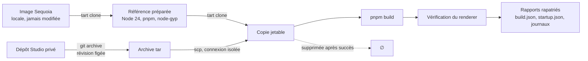

<div align="center">


# AI Desktop Studio — Action Fine-tuning

**Compagnon de préparation et d’évaluation d’un assistant local multilingue pour AI Desktop Studio.**

[](https://github.com/pasquelin/AI-Desktop-Studio-Action-Fine-tuning/actions/workflows/validate.yml)
[](.node-version)
[](package.json)
[](tsconfig.json)
[](biome.json)
[](package.json)
[](LICENSE)

**[→ AI Desktop Studio](https://www.aidesktopstudio.com/)**

</div>

---

## Ce que fait ce dépôt

Il prépare le terrain d’un assistant local pour AI Desktop Studio, avec téléchargement explicite du modèle local, mais **sans entraînement exécuté**. Trois choses fonctionnent aujourd’hui :

- **Extraire** le catalogue des actions de Studio depuis une révision précise, dans un bac à sable isolé du reste de l’application.
- **Inventorier** les scénarios d’usage — 310 actions réparties en 26 familles — et signaler leur dérive quand Studio évolue.
- **Construire** Studio dans une machine virtuelle macOS jetable et vérifier que son interface monte, sans toucher au poste de travail.

Ce qui n’existe pas encore : les parcours exécutés dans l’application, la capture de données et l’entraînement.

## État réel

Chaque ligne dit ce qui est **exécuté et vérifié**, pas ce qui est prévu.

| Capacité | État | Preuve |
| --- | --- | --- |
| Linter, typage, tests, hygiène Git | Fonctionne sans modèle | `npm run validate` |
| Export du catalogue d’actions | Fonctionne, avec contrôle de fraîcheur | [docs/export.md](docs/export.md) |
| Inventaire des scénarios | 310 actions, 26 familles, sans exécution | [docs/scenarios/](docs/scenarios/README.md) |
| Préparation et build en VM jetable | Recette réelle du 9 septembre 2026 | [docs/vm-usage.md](docs/vm-usage.md) |
| Chargement de l’interface Studio | Vérifié par son renderer, dans la VM | `startup.json` du rapport |
| Rendu 3D, sauvegarde, scénarios métier | **Non exécutés** | — |
| Capture de données, entraînement, fusion | **Non implémentés** | [docs/roadmap.md](docs/roadmap.md) |

> [!NOTE]
> La CI passe sur Linux et macOS. **Le job Windows échoue** sur une comparaison de chemins dans `src/catalogue/load-snapshot.ts` (noms courts 8.3 contre noms longs). Le badge ci-dessus reflète cet état réel plutôt que de le masquer.

## Démarrage

Prérequis : Git, Node **24.8 ou supérieur dans la branche 24**, pnpm **12.3.4** (npm **11** reste utilisable pour lancer les scripts). Aucun Python, GPU ou compte cloud nécessaire ici.

```sh
pnpm install --frozen-lockfile --ignore-scripts
pnpm run validate
```

L’installation initiale nécessite Internet ; la validation utilise ensuite les fichiers locaux. Aucun poids à installer pour les tests.

Si le lanceur pnpm local est indisponible :

```sh
npx --yes pnpm@12.3.4 install --frozen-lockfile --ignore-scripts
```

## Commandes

### Qualité

| Commande | Fonction |
| --- | --- |
| `npm run validate` | Toute la chaîne : linter, typage, tests, configuration, hygiène et fraîcheur |
| `npm run format` | Formatage et corrections sûres de Biome |
| `npm test` | Tests exécutés une fois |
| `npm run test:watch` | Tests pendant le développement |
| `npm run config:check` | Validation de la configuration |
| `npm run repo:check` | Noms, types et tailles des fichiers candidats Git |

### Catalogue et scénarios

| Commande | Fonction |
| --- | --- |
| `npm run catalogue:export -- --source CHEMIN` | Export complet depuis un checkout Studio |
| `npm run catalogue:check` | Contrôle de fraîcheur du catalogue configuré |
| `npm run freshness:check` | Écart entre scénarios, modèle et checkout Studio (avertissements) |

### Machine virtuelle

| Commande | Fonction |
| --- | --- |
| `npm run vm:observe` | Affiche l’adresse de la page locale d’observation |
| `npm run vm:run` | Enchaîne préparation et build dans une VM jetable |
| `npm run vm -- check` | Version de Tart et VM locales |
| `npm run vm -- prepare --source IMAGE` | Prépare une référence depuis une image locale |
| `npm run vm -- build --base REFERENCE` | Construit Studio dans une copie jetable |
| `npm run vm -- cleanup --name VM` | Supprime une VM appartenant à ce dépôt |

Mac Apple Silicon et [Tart](https://tart.run) requis pour les commandes VM. Détail dans [le mode d’emploi](docs/vm-usage.md).

## Lancer un test et ouvrir son suivi

`npm start` (ou `pnpm start`) lance le parcours et démarre automatiquement l’observateur. Le terminal affiche immédiatement son adresse complète : ouvrir ce lien dans le navigateur. Il n’y a pas de clé à saisir ni de deuxième commande à lancer. `npm run vm:run` fournit également le suivi pour le contrôle de construction/démarrage seul.

Un observateur déjà actif est réutilisé. Il reste disponible après le test pour consulter les résultats ; fermer l’onglet ne stoppe pas les tests. L’adresse reste toujours `http://127.0.0.1:4328/`, même après redémarrage. Le port fixe ne peut être occupé que par un seul observateur ; s’il est occupé par un autre service, le lancement échoue clairement au lieu de choisir une nouvelle adresse. Elle est également enregistrée dans `artifacts/vm/observer.json`.

Les captures sont produites après les actions, avec leur résultat, indépendamment de l’ouverture de la page. Seule la dernière session est conservée dans `artifacts/vm/captures/`. La liste suit l’ordre chronologique, avec les dernières images en bas. Aucun rafraîchissement manuel ni capture périodique : le suivi consulte seulement les images disponibles.

`npm run vm:observe` reste une commande facultative pour consulter les rapports sans lancer un nouveau test.

### Visuel et journaux dans la même fenêtre

Le bureau invité occupe le panneau gauche ; le panneau droit montre les étapes
et les sorties de la dernière exécution. La page tient dans la hauteur disponible :
le défilement reste dans le journal. Sur un écran étroit, les panneaux passent
l’un au-dessus de l’autre.

Les journaux se chargent automatiquement, puis se mettent à jour toutes les deux
secondes lorsque l’onglet est visible. Décocher **Suivre la fin** pour remonter dans
l’historique sans être ramené en bas. Ils restent consultables après le nettoyage
de la VM. Les prochaines exécutions alimentent `activity.log` au fil de la
construction et du cycle de vie ; les anciennes utilisent leur `build.log`
conservé. Les sorties du démarrage de Studio sont relayées pendant les prochains
builds. Il ne s’agit pas de tous les journaux système de macOS ni d’actions métier
qui n’ont pas encore été exécutées.

Le défilement manuel suspend le suivi de fin pendant trente secondes après le dernier mouvement, pour les étapes, les journaux et les captures. Un nouveau mouvement relance ce délai ; ensuite le suivi reprend automatiquement.

Pour les limites, le nettoyage et les rapports : [mode d’emploi VM](docs/vm-usage.md).

## Comment le banc VM fonctionne



Aucun partage de dossier, de presse-papiers ou de son. La copie de build est détruite au succès et conservée à l’échec, pour diagnostic. Les identifiants de l’hôte n’entrent jamais dans l’invité : seule une clé SSH dédiée au banc est générée, et seule sa partie publique est transférée.

## Organisation

| Dossier | Responsabilité |
| --- | --- |
| `src/config/` | Validation des configurations |
| `src/repository/` | Contrôles d’hygiène |
| `src/catalogue/` | Export du catalogue d’actions depuis Studio |
| `src/scenarios/` | Inventaire des scénarios et contrôle de fraîcheur |
| `src/studio/` | Lecture du checkout Studio configuré |
| `src/vm/` | Cycle de vie, propriété et transport des VM |
| `tools/` | Commandes locales |
| `configs/` | Choix du pilote, sans chemins personnels |
| `schemas/` | Formats versionnés implémentés |
| `tests/` | Comportements et rejets |
| `docs/` | Décisions, étapes et cadrage initial contextualisé |

## Modèles candidats

Modèle principal candidat : **Qwen3.5-2B** ; comparaison : **Qwen3-1.7B**. La configuration ne télécharge rien. Le premier essai Ollama conserve le format et l’empreinte du modèle. Les quinze langues configurées sont couvertes par des brouillons relus par IA, pas par une validation mondiale démontrée.

## Documentation

| Document | Contenu |
| --- | --- |
| [Contribution](CONTRIBUTING.md) | Règles de travail sur ce dépôt |
| [Décisions](docs/decisions.md) | Choix arrêtés et leurs raisons |
| [Étapes](docs/roadmap.md) | Ce qui reste à faire, dans l’ordre |
| [Export](docs/export.md) | Contrat et résultats de l’export du catalogue |
| [Scénarios](docs/scenarios/README.md) | Actions MCP, demandes existantes et cas candidats |
| [Environnement VM](docs/vm-environment.md) | Cadrage et choix d’isolation |
| [Mode d’emploi VM](docs/vm-usage.md) | Commandes, limites et recette réelle |
| [Validation](docs/validation.md) | Ce qui est contrôlé, et ce qui ne l’est pas |

## Organisation Git

`develop` accueille le travail courant. `main` est réservée aux versions à déployer. Aucun worktree supplémentaire.

## Licence

**[PolyForm Noncommercial 1.0.0](LICENSE)** — la même licence qu’AI Desktop Studio, dont ce
dépôt fait partie. Tout usage non commercial est permis : étude, recherche, expérimentation,
projets personnels, enseignement et organismes à but non lucratif. L’usage commercial ne
l’est pas.

Cette licence couvre le code de ce dépôt. Elle ne couvre ni les dépendances tierces, ni les
modèles candidats qu’il nomme : Apache 2.0 sur un modèle ne s’étend pas à ce code.

## Premier essai du modèle local

Ollama doit être installé et démarré. `npm run model:pull` télécharge explicitement Qwen3.5-2B. `npm run model:check` vérifie sa présence et affiche son empreinte. `npm run model:eval` réalise 34 demandes synthétiques sur 15 langues, sans exécuter une action Studio. Les commandes fonctionnent aussi avec `pnpm`.

Les rapports sont dans `artifacts/model/baseline.md` et `baseline.json`, hors Git. Ce sont des propositions avant entraînement, pas des scénarios métier validés. [Protocole et limites](docs/model-usage.md).

### Couverture multilingue complète à construire

La [stratégie multilingue](docs/multilingual-strategy.md) fixe les quinze langues, la relecture, les variantes et la séparation entraînement/test. Le [registre de couverture](docs/multilingual-coverage.csv) rattache les 5 165 cas de conception aux 310 actions et réserve leurs quinze couvertures linguistiques. Les cellules `planned` signalent un travail restant, pas un test rédigé ou validé.

### Fiches structurées de tout l’inventaire

`npm run scenarios:prepare` prépare les 5 165 cas et 63 parcours depuis les documents sources. Le résultat est consultable dans `artifacts/scenarios/README.md`. Les sources versionnables vivent dans `datasets/scenarios/` : variantes de paramètres, instructions et demandes des parcours en quinze langues, et références aux fixtures et contrôles du banc Studio. La génération refuse les doublons, actions sans cas, traductions absentes et paramètres de traduction perdus.

**Ce sont des brouillons, pas des scénarios opérationnels ni des données approuvées pour l’entraînement.** Les traductions automatiques peuvent changer le sens malgré une structure valide. Il reste à relire chaque formulation, construire les dialogues des cas individuels, lier les ressources réelles, préciser les contrôles métier et vérifier l’exécution. Les verdicts de schéma concernent les paramètres internes des actions ; ils ne prouvent ni le contrat MCP ni le résultat métier. Les sorties générées sont remplaçables : modifier leurs sources, pas les fichiers produits.

## Préparation des exemples et de LoRA

- `npm run scenarios:examples` : variantes de requêtes et exemples précis, avec blocages explicites. Voir [les limites métier](docs/scenario-examples.md).
- `npm run scenarios:split` : plan de séparation par familles, sans approbation automatique.
- [Installation et configuration LoRA](training/README.md) : environnement isolé, configuration de premier essai et état de validation.

Le dernier essai réel a créé et sauvegardé le projet, la scène et le cube, puis échoué à la réouverture. Aucune donnée n’est approuvée pour l’entraînement sur cette base.

## Banc de validation avant entraînement

`npm run bench:run` exécute le parcours de référence dans la VM avec le moteur commun et ses preuves. [Fonctionnement et couverture réellement exécutable](docs/test-bench.md). Les autres familles restent à raccorder ; aucune réussite métier n’est déduite des seuls schémas.

## Préparation complète du banc

`npm run prepare:bench` (ou `pnpm prepare:bench`) prépare les fichiers et vérifie les 63 parcours déclaratifs. Le rapport `artifacts/bench/preparation.json` distingue ceux qui peuvent être tentés de ceux qui attendent des fixtures ou des vérifications complémentaires. Ce nombre ne représente pas des tests réussis.

Pour un parcours : `npm run bench:run -- --journey P003`. La VM et son observateur démarrent ensemble. Les exemples restent exclus de LoRA tant que la preuve réelle et la relecture sémantique ne sont pas acceptées. Voir [le banc avant entraînement](docs/test-bench.md).
